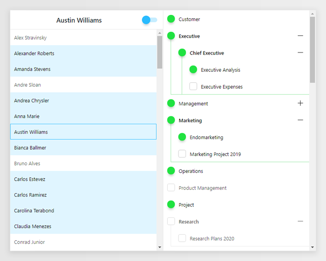
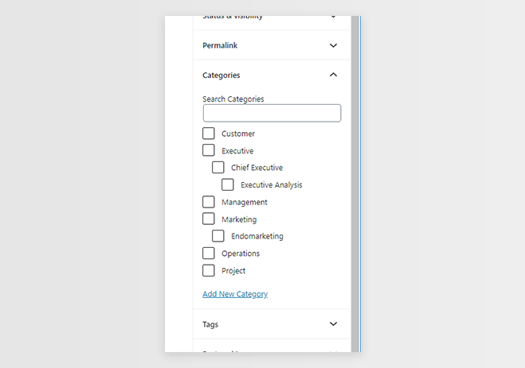
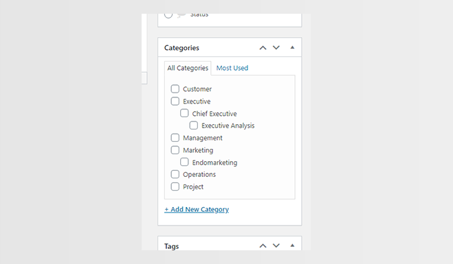

## Restrict Author Categories
A simple Wordpress plugin that allows Admins to restrict the categories a user can post on.

It also prevents users from creating, deleting or editing existing categories.

It works on both <strong>Block and Classic editors</strong>.

This plugin was made with <strong>PHP, MySQL and ReactJS</strong>.

<i>This is my first WP plugin. I've made it so i could learn how to make one and also to help at work. You can use, modify and extend it as you wish.</i>

## Screenshots
<h5 align="center">  </h5>
<h4 align="center">Restrict a user's categories...</h4>
 
<h5 align="center">  </h5>
<h4 align="center">...now they can select only the allowed categories...</h4>
 
<h5 align="center">  </h5>
<h4 align="center">...it also works at the Classic Editor.</h4>

## Installation

<i>Before installing the plugin, you'll need to have a WP local server. If you don't have any yet, you can use <a href="https://localwp.com/">Local by Flywheel</a></i>

Assuming your WP server is set, you have to install the plugin on WP:
1. Copy the dir <strong>/wp/trunk</strong> to your WP plugins dir (<strong>/wp-content/plugins</strong>).
2. Change the name of the dir to <strong>restrict-author-categories</strong>.
3. Now open the WP admin page on your browser and activate the plugin.

Then you'll need to install the React App:
1. Open the <strong>reactjs</strong> dir with command line and type <i><strong>npm -i</strong></i>
2. After the installation completes, open <strong>reactjs/src/resources.js</strong> file and change the <strong>wp_localhost_domain</strong> var to your WP localhost domain.

While on the development environment, you'll need to config your <strong>WP REST Routes</strong> so your React Live Server can access them:
1. On the WP Plugin dir, open <strong>/database/db_rest_api.php</strong> file.
2. Comment lines <strong>16 to 22</strong>. <i>(remember to uncomment on production)</i>

<i>Beware that you'll need to set your WP local server <strong>CORS Restrictions</strong> to allow the React Live Server, so it can access the <strong>WP REST Routes</strong></i>.

Now you only need to run the command <i><strong>npm run start</strong></i> on the <strong>reactjs</strong> dir to start the React Live Server, and start developing.

## Technologies Involved

- PHP
- MySQL
- ReactJS
